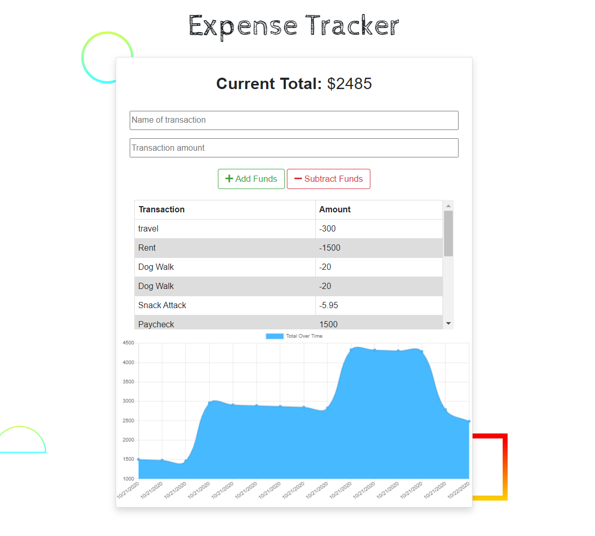

# Expense Tracker PWA 

    
## Description

**Expense Tracker PWA** is a progressive web application that allows the user to add expenses and deposits to their budget with or without a connection.

### Demo 

### Technologies Used

* MongoDB
* Mongoose
* Express
* Morgan
* Compression
* Heroku
* Dotenv

### Installation

npm install

#### Running

npm run dev

    
